<div align="center">
  <h2>Orderly</h2>
</div>

> Orderly is a cutting-edge web system designed to streamline operations for restaurant and food businesses (RMS).
> It draws from the principles of Domain-Driven Design (DDD) and Architectures to ensure scalability, maintainability, and a robust integration capability.

<br>

> GitHub

<br>

## How to run the application

## Running on docker

```bash
# up with build
$ docker compose up --build

# up with detached mode 
$ docker compose up -d

# down the app
$ docker compose down
```

## Running on kubernetes

```bash
# create namespace orderly
$ kubectl apply -f k8s/namespaces.yaml

# set orderly namespace to default
$ kubectl config set-context --current --namespace=orderly

# message-broker
$ kubectl apply -f k8s/message-broker/

# database
$ kubectl apply -f k8s/db/

# api
$ kubectl apply -f k8s/api/

# api-gateway
$ kubectl apply -f k8s/api-gateway/

# proxy
$ kubectl apply -f k8s/proxy/

# to watch all pods running
$ watch -n1 kubectl get pods
```

<br>

### Domain Driven Design

## Context Map

<p align="center">
  <a target="blank">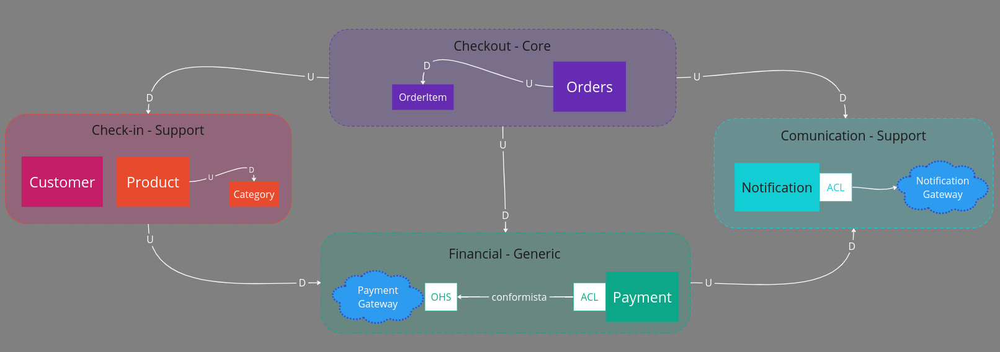</a>
</p>

<br>

## Use cases


### - Check-in flow

<p align="center">
  <a target="blank">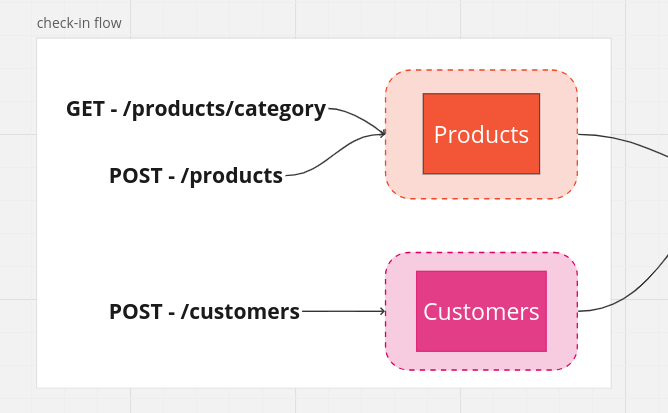</a>
</p>

### - Create order-payment flow

<p align="center">
  <a target="blank">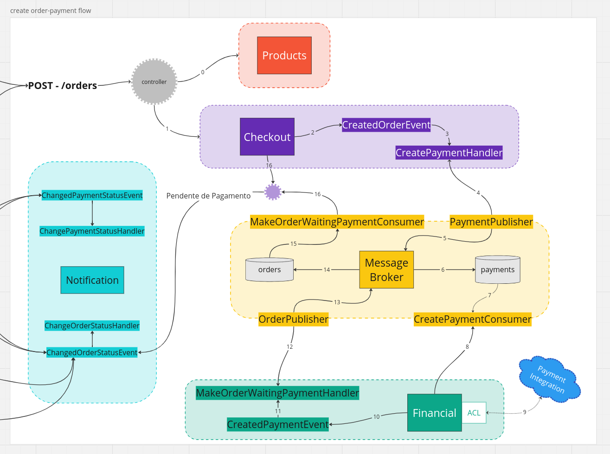</a>
</p>

### - approve/cancel payment and prepare/withdrawn orders

<p align="center">
  <a target="blank">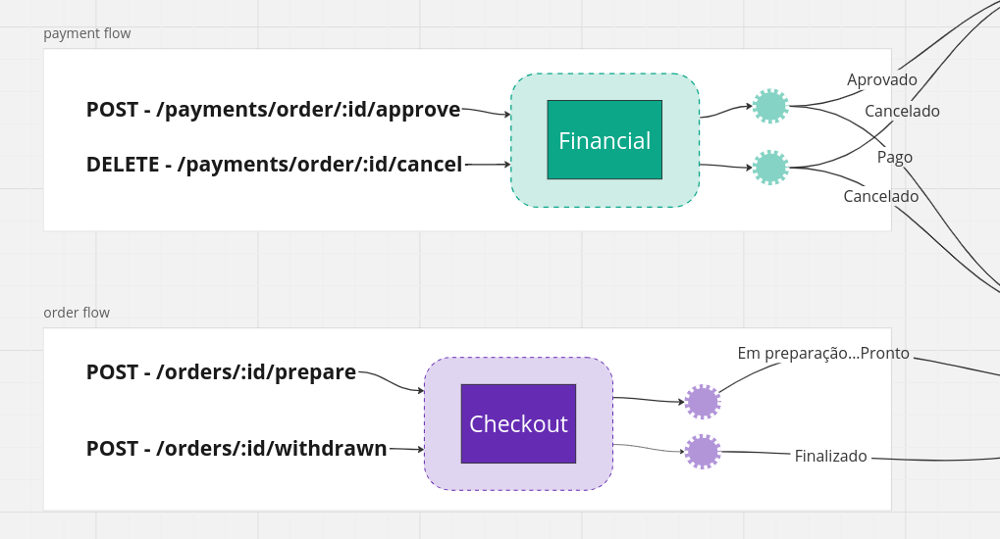</a>
</p>

### - Complete flow

<p align="center">
  <a target="blank">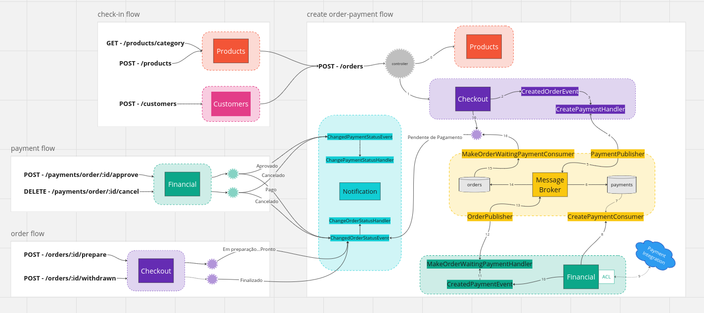</a>
</p>


<br>

## Kubernetes Diagram - Infrastructure

<p align="center">
  <a target="blank">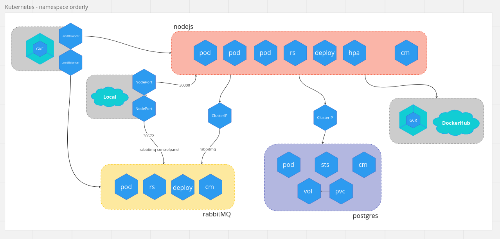</a>
</p>

<br>

<br>

## Cloud Diagram - Infrastructure

<p align="center">
  <a target="blank"></a>
</p>

<p align="center">
  <a target="blank">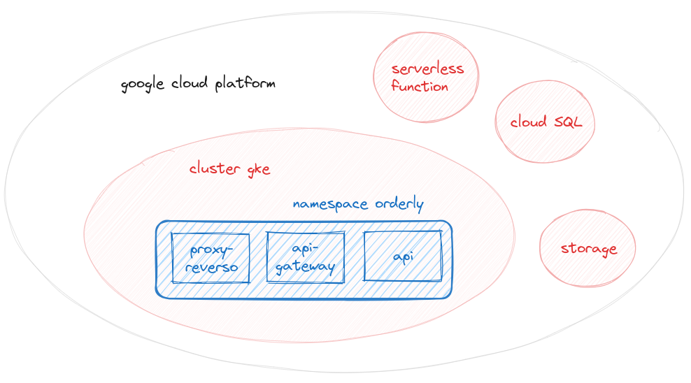</a>
</p>

<p align="center">
  <a target="blank"></a>
</p>

<p align="center">
  <a target="blank">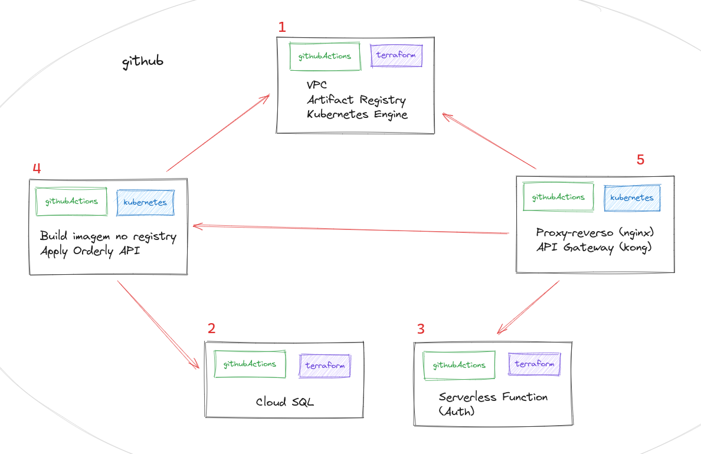</a>
</p>

<br>


## Clean Architecture

<p align="center">
  <a target="blank">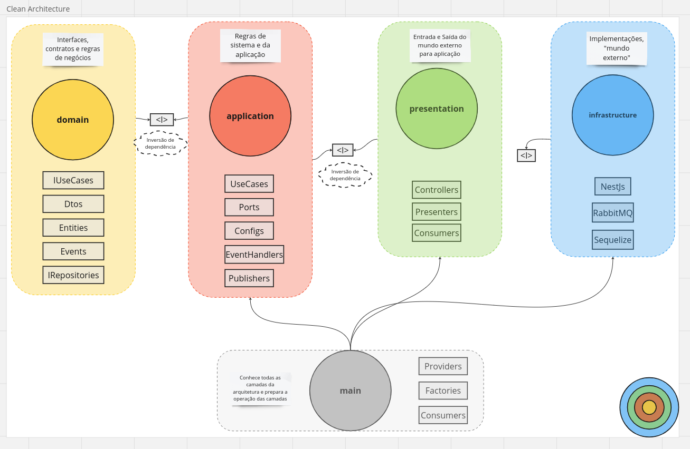</a>
</p>

<br>

## Resources

#### - Message Broker

<p align="center">
  <a target="blank">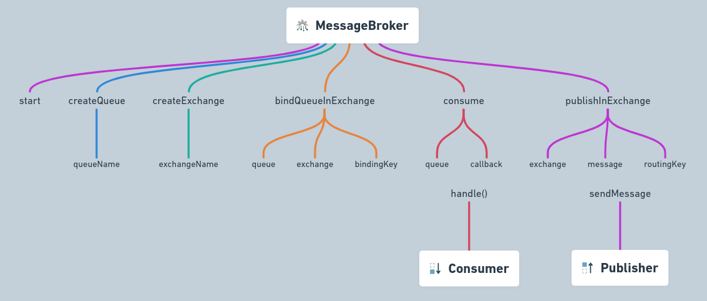</a>
</p>

#### - Events

<p align="center">
  <a target="blank">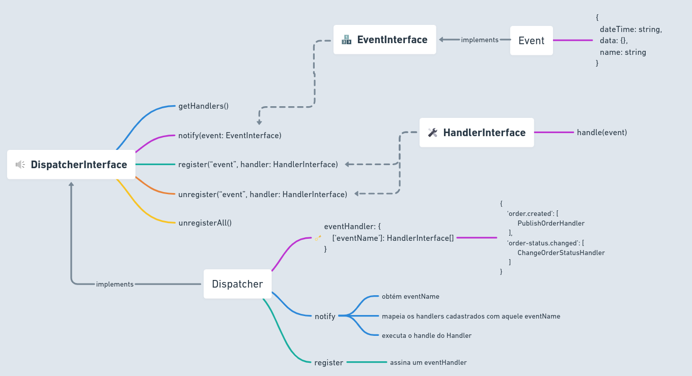</a>
</p>

#### - Entity Relationship Diagram - Database

<p align="center">
  <a target="blank"></a>
</p>

