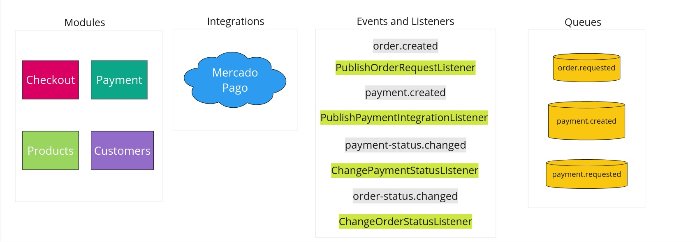
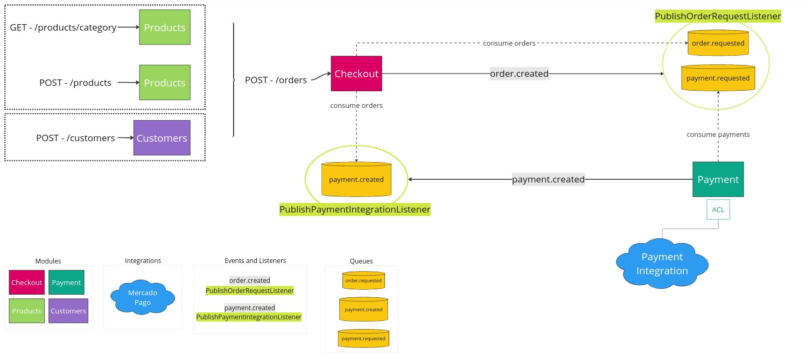

<p align="center">
  <a href="http://nestjs.com/" target="blank"></a>
</p>

## Installation

```bash
$ npm install
```


## Running docker

```bash
# up with build
$ docker compose up --build

# up with detached mode 
$ docker compose up -d

# down the app
$ docker compose down
```

## Running kubernetes

```bash
# create namespace orderly
$ kubectl create ns orderly

# set orderly namespace to default
$ kubectl config set-context --current --namespace=orderly

# cache
$ kubectl apply -f k8s/cache

# database
$ kubectl apply -f k8s/db

# api
$ kubectl apply -f k8s/api
```

<p align="center">
  <a target="blank"></a>
</p>


## Entity Relationship Diagram - Database

<p align="center">
  <a target="blank"></a>
</p>

## Domain Driven Design - Context Map

<p align="center">
  <a target="blank"></a>
</p>

## Use cases

#### - Labels

<p align="center">
  <a target="blank"></a>
</p>

### - Create order

<p align="center">
  <a target="blank"></a>
</p>

### - Pay order

<p align="center">
  <a target="blank"></a>
</p>

### - Prepare order

<p align="center">
  <a target="blank"></a>
</p>

### - Withdrawn order

<p align="center">
  <a target="blank"></a>
</p>